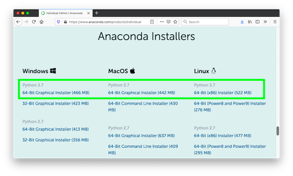
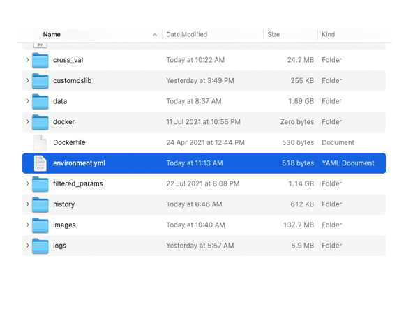
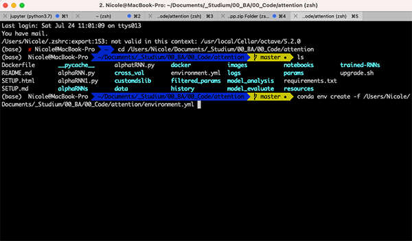
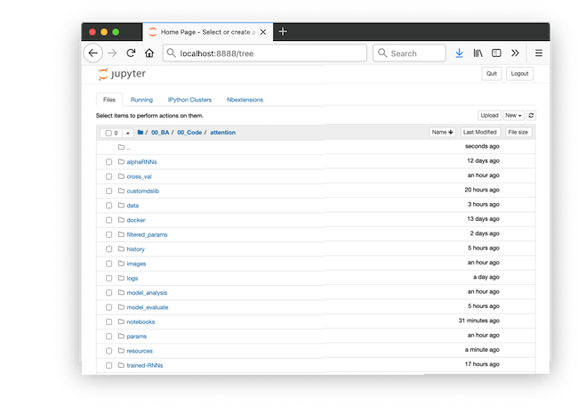

# Setup Guide
This guide contains instructions for installing the software necessary to run the Jupyter notebooks accompanying the thesis *Dynamic and Context Dependent
Stock Price Prediction with Attention Modules and News Sentiment*

If you have already installed Anaconda and set up the "attDL" virtual environment, skip to Step 3 below for instructions on running the notebooks.

### System Requirements
* 64-bit operating system
* 8GB RAM (16GB and more is recommended to run the more computational intensive notebooks)
* 500MB free disk space

## 1. Install Anaconda

If you already have Anaconda installed, skip to Step 2 below. First, copy and paste this link into your browser's address bar and download the latest Python 3.x Anaconda installer for your operating system:

    https://www.anaconda.com/products/individual

Then go to the link below corresponding to your operating system and follow the instructions to install Anaconda:

Linux: <https://docs.anaconda.com/anaconda/install/linux/>

macOS: <https://docs.anaconda.com/anaconda/install/mac-os/>

Windows: <https://docs.anaconda.com/anaconda/install/windows/>

## 2. Set Up the Virtual Environment

We will create a virtual environment called "attDL" from the specifications in the file *environment.yml* (macOS/Linux) or *environment_WINDOWS.yml* (Windows), which are in the *attention* folder. When it is active, Python will have access to all of the packages used to run the notebooks. 

1. Open a window of your operating system's file manager and navigate to the *attention* folder. You should be able to see the *environment.yml* files.

2. Leaving that window open, open a Terminal (macOS/Linux) or the Anaconda Prompt (Windows)

    * On macOS, open a Finder window, then press **Cmd+Shift+U** to enter the Utilities folder. Double-click the *Terminal* application to open it.
    
    * On Windows, open the Start menu and type "Anaconda Prompt". Then, click on the *Anaconda Prompt (anaconda3)* application to open it.
    
    * On Ubuntu, you can press **Ctrl+Alt+T** to open a terminal window.

3. Type the command below, __*followed by a space*__.

        conda env create -f 
    
4. Drag and drop the *environment.yml* (macOS/Linux) or *environment_WINDOWS.yml* (Windows) file from the *attention* folder into the Terminal/Anaconda Prompt window. This will complete the command with the path to the *environment.yml* file. 

    **Make sure you use the correct .yml file for your operating system** 
    
    It should look like this (though the actual path will vary):

5. Press Enter to run the command. It will take several minutes to complete. When it has finished, you will be able to follow the steps in the next section to start the Jupyter notebook server and run the notebooks

## 3. Starting the Notebook Server

After the installation has completed, you can follow the steps below to start a Jupyter notebook server and show the *attention* directory whenever you wish to use the notebooks. 

1. Open a Terminal (macOS/Linux) or the Anaconda Prompt (Windows)

2. Activate the virtual Python environment for the notebooks. This switches to the Python installation we created above, which contains the libraries used by the notebooks. 

        conda activate attDL
  
3. Navigate to the *attention* directory by using the `cd` command, followed by the path to the folder.
    
        cd /path/to/your/attention
 
4. Start the jupyter notebook server
    
        jupyter notebook
    
    This should open a browser window showing the *attention* directory in the Jupyter dashboard. You may now select the notebook folder and after entering the folder click on a notebook to open it.

    

## 4. Deactive the Virtual Environment

To deactivate the virtual environment type the following command into your terminal:

        conda deactivate     

